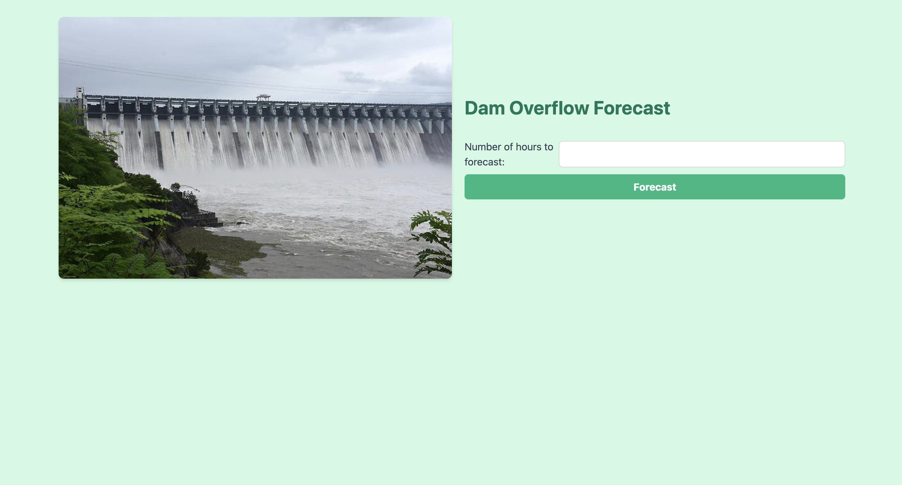
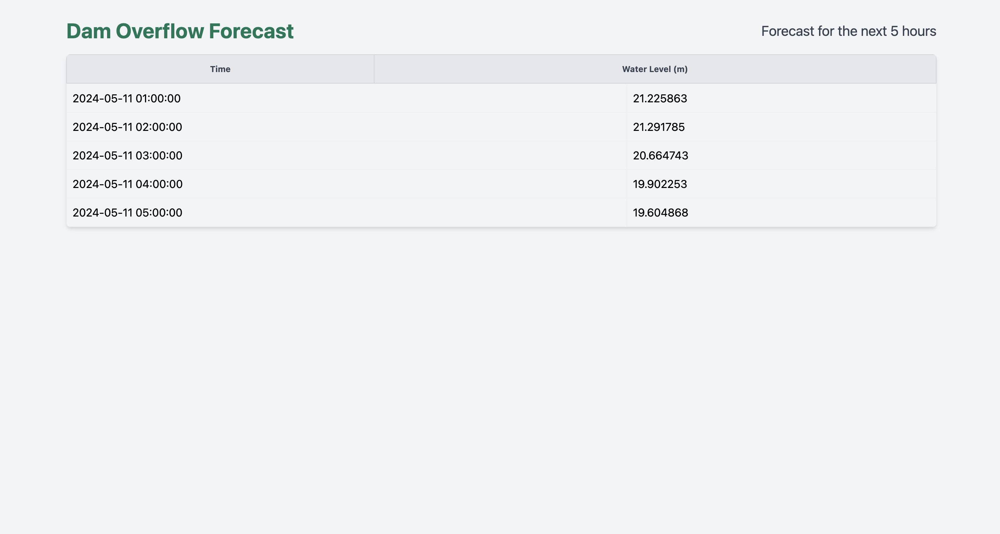

# Dam Water Level Forecast Web App

This is a Flask web application that uses the Prophet library for time series forecasting to predict future water levels of a dam. The app allows users to input the number of hours for which they want to forecast the water level, and it displays the predicted values in a tabular format.

## Features

- Load and preprocess dam water level data from a CSV file.
- Train a Prophet model on the historical data.
- Provide a user interface to input the number of hours for forecasting.
- Generate and display the forecasted water level values for the specified number of hours.

## Installation

1. Clone the repository:
'git clone https://github.com/sucvijay/Dam-Water-Level-Forecast-Web-App-using-ML-and-Flask.git'

2. Navigate to the project directory:
'cd dam-water-level-forecast'

3. Install the required dependencies:
'pip install -r requirements.txt'

4. Place your dam water level data CSV file in the project directory and name it `dam_data.csv`.

## Usage

1. Run the Flask application:
'python3 -m flask run'

2. Open your web browser and navigate to `http://localhost:5000`.

3. You should see the homepage of the application:

4. Enter the number of hours for which you want to forecast the water level and click the "Forecast" button.

5. The application will display the forecasted water level values in a tabular format:

## Contributing

Contributions are welcome! If you find any issues or have suggestions for improvements, please open an issue or submit a pull request.